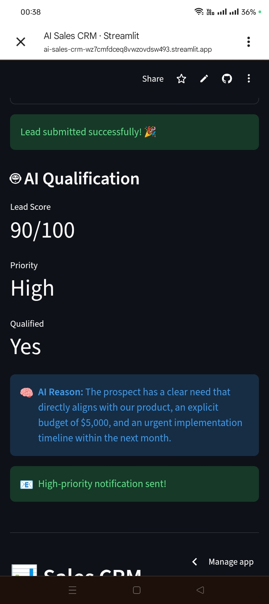

# 🤖 AI Sales CRM Assistant

An AI-powered sales CRM that automatically captures, qualifies, scores, prioritizes, and routes incoming leads.

## 🚀 Project Overview

The AI Sales CRM Assistant is an automated lead-management system designed to help sales teams identify high-value prospects faster.

When a new lead submits the form, the system:

1. Captures the lead's information.
2. Sends the lead information to Google Gemini.
3. Generates an AI qualification score from 0–100.
4. Assigns a priority level: High, Medium, or Low.
5. Determines whether the lead is qualified.
6. Generates an explanation for the AI's decision.
7. Stores the lead and AI results in Supabase/PostgreSQL.
8. Sends an email notification when a lead is classified as High priority.
9. Records whether the notification was sent.
10. Displays the leads and analytics in a CRM dashboard.

## 🔄 Workflow

```text
New Lead
   ↓
Streamlit Form
   ↓
Google Gemini
   ↓
AI Qualification
   ├── Score (0–100)
   ├── Priority
   ├── Qualified / Not Qualified
   └── AI Reason
   ↓
Supabase / PostgreSQL
   ↓
High Priority?
   ↓
Resend Email Notification
   ↓
CRM Dashboard
```

## ✨ Features

### Lead Capture

Sales leads can submit:

* Name
* Email
* Company
* Message

### AI Lead Qualification

Google Gemini analyzes the lead and generates:

* Lead score
* Priority
* Qualification status
* Reasoning behind the decision

### Automated Lead Routing

High-priority leads automatically trigger an email notification to the sales team.

### CRM Dashboard

The dashboard provides:

* Total number of leads
* High-priority leads
* Qualified leads
* Average lead score
* Priority distribution
* Notification tracking
* Lead filtering
* Individual lead details
* AI reasoning

## 🧪 Demo Results

The system was tested using different lead scenarios:

| Lead          |  Score | Priority | Qualified |
| ------------- | -----: | -------- | --------- |
| Sarah Mwangi  | 95/100 | High     | Yes       |
| Brian Otieno  | 65/100 | Medium   | Yes       |
| Kevin Njoroge | 15/100 | Low      | No        |

This demonstrates that the AI can differentiate leads based on intent, urgency, business need, and readiness to purchase.
## 📸 Application Screenshot


## 🛠️ Technologies

* Python
* Streamlit
* Google Gemini API
* Supabase
* PostgreSQL
* Resend
* Pandas
* GitHub

## 🔐 Security

API keys and credentials are stored using Streamlit secrets and are not included directly in the source code.

The project uses Supabase Row Level Security to control database access.

## 📁 Project Structure

```text
AI-Sales-CRM/
│
├── streamlit_app.py
├── requirements.txt
└── README.md
```

## ⚙️ How It Works

### 1. Lead Submission

A prospect enters their information through the Streamlit form.

### 2. AI Analysis

The lead information is sent to Gemini with a structured prompt requesting a score, priority, qualification status, and explanation.

### 3. Database Storage

The lead and AI-generated information are stored in Supabase.

### 4. Automated Notification

If Gemini classifies the lead as High priority, Resend sends a notification to the sales team.

### 5. Dashboard

Sales teams can view, filter, and analyze leads through the CRM dashboard.

## 📈 Example

A lead saying:

> "We have an approved budget, 30 sales representatives, and want to implement an AI solution within two weeks."

may receive:

```text
Score: 95/100
Priority: High
Qualified: Yes
```

The system then automatically sends a notification to the sales team.

## 🎯 Business Value

The system demonstrates how AI automation can reduce manual lead qualification and help sales teams focus their attention on high-intent prospects.

Instead of manually reviewing every incoming lead, the system automatically analyzes and prioritizes them.

## 🔮 Future Improvements

Possible future improvements include:

* Slack notifications
* Duplicate lead detection
* CRM integrations such as HubSpot
* Lead assignment to individual sales representatives
* Follow-up reminders
* Authentication for sales users
* Advanced analytics
* Lead conversion tracking
* AI-generated follow-up emails

## 👩🏽‍💻 Author

**Caroline Maina**

AI Automation & Generative AI Projects

GitHub: `carolinemainaprojects`

```
```
# ai-sales-crm
AI-powered sales CRM assistant that automatically qualifies and prioritizes leads using Gemini AI.
